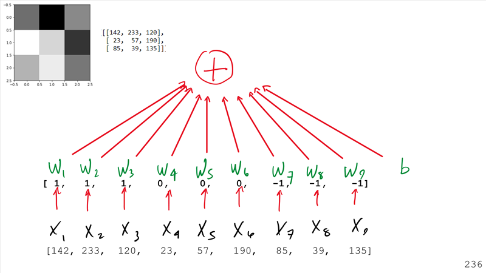

# Deep Learning with PyTorch
This repo is a resource for my Deep Learning with PyTorch talk. It
contains all of the code that was demonstrated as well as the deck.

## Inspiration
This talk is inspired by a PyTorch tutorial available [online](https://pytorch.org/tutorials/beginner/pytorch_with_examples.html).
It is also inspired by a silly nine squares image problem.

The purpose of this silly problem is to provide the basic intution
behind models, cost, accuracy, and optimization principles behind
machine learning.

## Overview

### Deep Learning Principles

 - input 
 - model function 
 - cost function
 - optimization method 

### PyTorch

 - Tensors
 - DataSets
 - DataLoaders
 - Models
 - Loss (or Cost)
 - Optimization

### Tools

 - ONNX
 - Azure Machine Learning service
